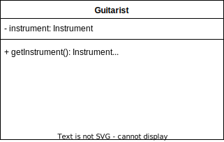

# Introduction

* In **Systems Design**, you model for one important reason: to manage complexity.
* **Modeling** allows us to focus on, capture, document, and communicate the important aspects of a system's design.
* A **Model** is an abstraction of the real thing.
* When you model a system, you abstract away any details that are irrelevant or potentially confusing.
* Your Model is a simplification of Real System. 
* **Model** allows the design and viability of a system to be understood, evaluated and criticized quicker than if you had to dig through the actual system itself.

## What's in a Modeling Language?

* A **Modeling Language** can be made up of pseudocode, actual code, pictures, diagrams or long passages if description.
* The elements that make up a modeling language are called its _notation_.

_Figure 1-1: A class Declaration as it can be shown using UML Notation._

### Detail Overload : Modeling with Code

### Verbosity, Ambiguity, Confusion: Modeling with Informal Languages

### Getting the balance right: Formal Languages

## Why UML 2.0?

## Models and Diagrams

## "Degress" of UML

## UML and Software Development Processes.

## Views of your Model

## A First Taste of UML

### Notes

### StereoTypes

#### StereoType Applied to Classes

#### StereoType Applied to components

#### StereoType Applied to Artifacts

#### Tagged Values

## Want more Information?
